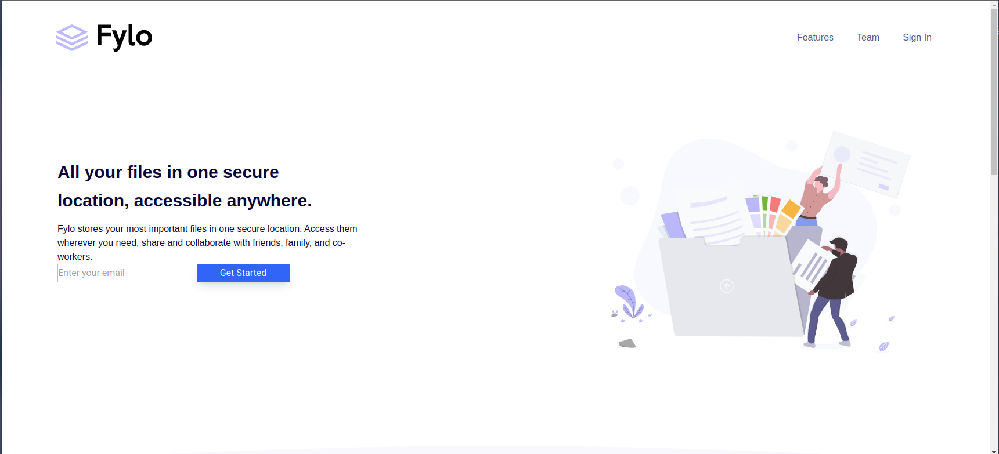
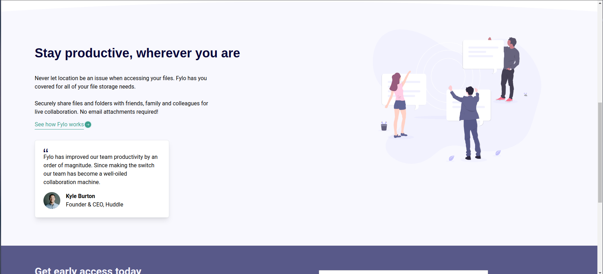
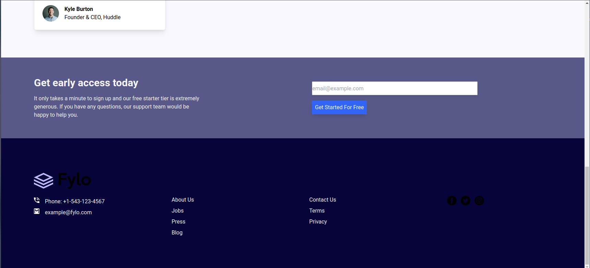

# Frontend Mentor - Fylo landing page with two column layout solution

## Table of contents

- [Overview](#overview)
  - [The challenge](#the-challenge)
  - [Screenshot](#screenshot)
  - [Links](#links)
- [My process](#my-process)
  - [Built with](#built-with)
  - [What I learned](#what-i-learned)
- [Author](#author)

## Overview

### The challenge

Users should be able to:

- View the optimal layout for the site depending on their device's screen size
- See hover states for all interactive elements on the page

### Screenshot

### Links

- Solution URL: [solution at Mlowegene](https://github.com/Mlowegene/Fylo-landing-page)
- Live Site URL: [Fylo-landing-page](https://mlowegene.github.io/Fylo-landing-page/)

## My process

### Built with

- Semantic HTML5 markup
- CSS custom properties
- Flexbox
- Tailwind CSS

### What I learned

I have learned how to use Tailwind flamework of CSS.

## Author

- Website - [fylo-landing page](https://mlowegene.github.io/Fylo-landing-page/)
- Frontend Mentor - [@Mlowegene](https://www.frontendmentor.io/profile/Mlowegene)
